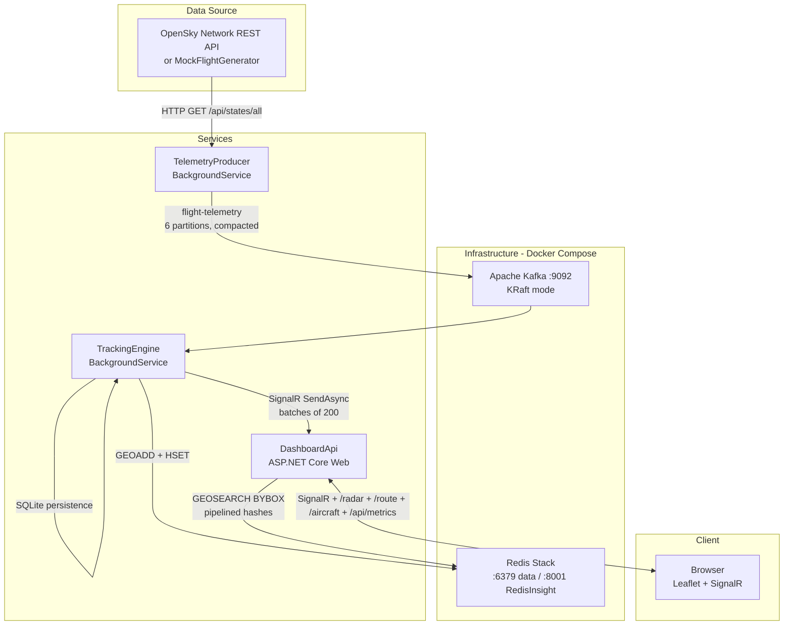

# Air Traffic Control Visualizer — Design Document

**Repository:** <https://github.com/ravindrabhartiya/AirTrafficVisualizer.git>

---

## Table of Contents

1. [Overview](#overview)
2. [Architecture](#architecture)
3. [Data Flow](#data-flow)
4. [Project Structure](#project-structure)
5. [Component Details](#component-details)
   - [ATC.Shared](#atcshared)
   - [ATC.TelemetryProducer](#atctelemetryproducer)
   - [ATC.TrackingEngine](#atctrackingengine)
   - [ATC.DashboardApi](#atcdashboardapi)
   - [ATC.Tests](#atctests)
6. [Infrastructure](#infrastructure)
7. [Data Models](#data-models)
8. [Performance Optimizations](#performance-optimizations)
9. [Cold-Start Recovery](#cold-start-recovery)
10. [Credential Management](#credential-management)
11. [Rate Limiting](#rate-limiting)
12. [Frontend Dashboard](#frontend-dashboard)
13. [Backend Metrics Dashboard](#backend-metrics-dashboard)
14. [Configuration Reference](#configuration-reference)
15. [Getting Started](#getting-started)
16. [Testing](#testing)
17. [Known Limitations](#known-limitations)

---

## Overview

Air Traffic Control Visualizer is a real-time flight tracking system that ingests live aircraft positions from the [OpenSky Network](https://opensky-network.org/) REST API (or generates mock data), streams them through Apache Kafka, processes them, and renders them on an interactive Leaflet.js map in the browser — all with sub-second update latency via SignalR.

### Key Capabilities

| Capability | Detail |
|---|---|
| Live flight ingestion | OpenSky Network `/api/states/all` with HTTP Basic Auth |
| Mock mode | 200 simulated flights over the continental US |
| Stream processing | Apache Kafka with compacted topic, 3 parallel consumers |
| Spatial queries | Redis Geo commands for viewport filtering and spatial lookups |
| Real-time push | ASP.NET Core SignalR WebSocket hub with batched broadcasting |
| Persistence | SQLite snapshot store with async background drain (decoupled from consumers) |
| Route lookup | Per-callsign route lookup via adsbdb.com, cached in Redis |
| Aircraft info | Per-ICAO24 registration/type/owner lookup via hexdb.io |
| Viewport filtering | Bbox-scoped `/radar` queries via Redis `GEOSEARCH BYBOX` |
| Response compression | Brotli + Gzip middleware for all JSON responses |
| Compact wire format | Short JSON property names reduce payload ~28% per flight |
| Oceanic extrapolation | Client-side dead-reckoning for flights without live updates |
| Backend metrics | Real-time Kafka / Redis / SQLite monitoring dashboard |

### Tech Stack

- **.NET 8.0** (C# 12, top-level statements, nullable reference types)
- **Apache Kafka** — single-node KRaft (no ZooKeeper) via Docker
- **Redis Stack** — geo operations + hash storage + RedisInsight UI
- **SQLite** — `Microsoft.Data.Sqlite` for lightweight persistence
- **SignalR** — real-time WebSocket push to browser clients
- **Leaflet.js** — interactive map with CARTO Voyager tiles (English labels)
- **xUnit + Moq** — unit tests
- **Docker Compose** — infrastructure orchestration

---

## Architecture



---

## Data Flow

1. **Ingest** — `TelemetryProducer` polls OpenSky every 10 s (authenticated) or 22 s (anonymous). Each response contains ~5,000–12,000 global aircraft states. Flights with null lat/lon are discarded. Each valid flight is serialized as JSON and produced to Kafka topic `flight-telemetry`, keyed by ICAO24 transponder address.

2. **Process** — `TrackingEngine` runs 3 parallel Kafka consumers. For each message:
   - **Staleness filter** — messages older than 2 minutes are discarded aggressively.
   - Stores the position in a Redis **geo sorted set** (`active_flights`) for spatial queries.
   - Stores all flight metadata in a Redis **hash** (`flight:{icao24}`) with a 5-minute TTL.
   - **Enqueues** to a `ConcurrentQueue` for batched SignalR delivery.
   - **Enqueues** to a bounded `Channel<FlightPosition>` for async SQLite persistence (non-blocking, drop-oldest if full).

3. **Batch flush** — Every 500 ms, a dedicated flush task drains up to 200 items from the queue and sends them as a single `BroadcastFlightBatch` message via `hub.SendAsync()` (fire-and-forget). This replaces per-message `InvokeAsync` to avoid consumer stalls.

4. **Serve** — `DashboardApi` broadcasts the `FlightBatchUpdated` event to all connected browser clients. The `/radar` endpoint supports viewport bbox filtering via `GEOSEARCH BYBOX` and returns results using Redis pipelining (`CreateBatch`) for a single round-trip. Responses are compressed with Brotli/Gzip.

5. **Render** — The browser normalizes compact JSON property names, updates Leaflet markers in real time, and extrapolates positions for flights without recent updates. Every 30 seconds the browser polls `GET /radar` with viewport bounds as a reconciliation fallback. Map pan/zoom also triggers a reload.

6. **Cleanup** — Every 60 seconds, `TrackingEngine` scans the geo set and removes entries whose hash has expired. SQLite purge only happens when consumers are actively receiving data (prevents destroying recovery snapshots during stalls).

---

## Project Structure

```
AirTrafficControl.slnx          # Solution file (XML-based slim format)
docker-compose.yaml              # Kafka + Redis infrastructure
start-all.bat                    # One-click launcher (build → test → infra → services)
DESIGN.md                        # This document
.gitignore                       # Excludes bin/, obj/, *.db, credentials, secrets

src/
  ATC.Shared/                    # Shared library (models, constants, persistence)
    FlightTelemetry.cs           # Inbound DTO from OpenSky
    FlightPosition.cs            # Outbound DTO with compact JSON names
    Constants.cs                 # Kafka topic, Redis keys, thresholds
    GeoHelpers.cs                # Bbox parsing, flight-from-dict mapping
    IFlightSnapshotStore.cs      # Persistence interface
    SqliteFlightSnapshotStore.cs # Thread-safe SQLite implementation

  ATC.TelemetryProducer/         # Worker service — data ingestion
    Program.cs                   # DI, Kafka, Redis, HttpClient, rate limiter
    Worker.cs                    # Main loop — fetch → produce → rate limit
    MockFlightGenerator.cs       # 200 simulated flights for offline dev
    RetryAfterHandler.cs         # HTTP 429 handler with Retry-After support

  ATC.TrackingEngine/            # Worker service — stream processing
    Program.cs                   # DI, Kafka consumer, Redis, SQLite, SignalR config
    Worker.cs                    # 3 parallel consumers, batched SignalR, cleanup
    FlightProcessor.cs           # Core logic: Redis store, persist to SQLite
    SignalRConfig.cs             # Record for SignalR hub URL

  ATC.DashboardApi/              # ASP.NET Core web app — dashboard
    Program.cs                   # DI, Redis, SQLite, CORS, compression, endpoints
    FlightHub.cs                 # SignalR hub — single + batch broadcast
    wwwroot/index.html           # Live radar SPA (Leaflet + SignalR client)
    wwwroot/metrics.html         # Backend metrics monitoring dashboard

tests/
  ATC.Tests/                     # xUnit test project (39 tests)
    SqliteFlightSnapshotStoreTests.cs
    MockFlightGeneratorTests.cs
    SharedModelTests.cs
    RetryAfterHandlerTests.cs
    FlightHubTests.cs
    TrackingEngineTests.cs
    GeoHelpersTests.cs           # Bbox, flight mapping, compact JSON tests
```

---

## Component Details

### ATC.Shared

Shared class library referenced by all three services.

| Type | Purpose |
|---|---|
| `FlightTelemetry` | Inbound DTO. Fields are nullable (OpenSky may omit values). JSON property names match OpenSky conventions. |
| `FlightPosition` | Outbound DTO. Non-nullable. Compact JSON property names (`cs`, `lat`, `lon`, `alt`, `vel`, `trk`, `vr`, `gnd`, `cty`, `ts`) reduce wire size ~28%. Used by `GET /radar`, SignalR push, and SQLite persistence. |
| `Constants` | `KafkaTopic = "flight-telemetry"`, `RedisGeoKey = "active_flights"`. |
| `GeoHelpers` | Pure static helpers: `ParseBbox(sw/ne coords)` → `BboxParams` record (center + dimensions with 10% padding) for Redis `GEOSEARCH BYBOX`; `ParseFlightFromDict(icao, dict)` → `FlightPosition` from Redis hash dictionary. |
| `IFlightSnapshotStore` | Persistence interface: `UpsertAsync`, `LoadAllAsync(maxAge)`, `PurgeStaleAsync(maxAge)`. |
| `SqliteFlightSnapshotStore` | Thread-safe SQLite implementation. Uses `SemaphoreSlim(1,1)` to serialize concurrent access from parallel consumers. Auto-creates schema on construction. `INSERT … ON CONFLICT … DO UPDATE` for upsert. Implements `IDisposable`. |

**NuGet dependencies:** `Microsoft.Data.Sqlite` 8.0.12, `System.Text.Json` 10.0.5

### ATC.TelemetryProducer

Background worker service that fetches flight data and publishes to Kafka.

**Startup flow:**
1. Read OpenSky credentials from configuration (User Secrets / env vars / appsettings).
2. If credentials are present, attach HTTP Basic Auth header and set rate limiter to 10 s. Otherwise 22 s.
3. Check Redis for last API call timestamp to avoid double-dipping on restart.
4. Enter main loop: acquire rate-limiter token → fetch → produce → repeat.

**Key classes:**

| Class | Responsibility |
|---|---|
| `Worker` | Main `ExecuteAsync` loop. Fetches from OpenSky or `MockFlightGenerator`, produces to Kafka. |
| `MockFlightGenerator` | Creates 200 simulated flights with realistic movement patterns. Every 10th flight is clustered near the previous flight to trigger collision detection. |
| `RetryAfterHandler` | `DelegatingHandler` that intercepts HTTP 429 responses, reads the `Retry-After` header, and blocks subsequent requests until the cooldown expires. |

**NuGet dependencies:** `Confluent.Kafka`, `StackExchange.Redis`, `Microsoft.Extensions.Http`

### ATC.TrackingEngine

Background worker service that consumes from Kafka, processes flights, and pushes updates to the dashboard.

**Startup flow:**
1. **Warm Redis from SQLite** — loads flights updated within the last 30 minutes and populates the geo set + hash entries. This gives the dashboard immediate data after a restart.
2. Connect to SignalR hub on `DashboardApi` (with automatic reconnect).
3. Launch five parallel tasks:
   - **3 Kafka consumer tasks** — each consumes messages, applies a 2-minute staleness filter, delegates to `FlightProcessor` (Redis only), and enqueues results to a `ConcurrentQueue` (SignalR) and a bounded `Channel` (SQLite).
   - **SignalR batch flush task** — every 500 ms, drains up to 200 items from the queue and sends via `hub.SendAsync("BroadcastFlightBatch", batch)` (fire-and-forget).
   - **SQLite background drain task** — reads from the bounded `Channel<FlightPosition>` (capacity 10,000, drop-oldest), de-duplicates by ICAO24, and batches up to 500 upserts. Completely decoupled from the consumer hot path so SQLite I/O never blocks Kafka consumption.
   - **Cleanup task** — every 60 s, removes geo entries whose hash has expired and purges stale SQLite rows (only when consumers are actively receiving data).

**Key design decisions:**
- Consumers use `Task.Run(async () => ...)` to offload the blocking `Consume()` call to a thread-pool thread while properly `await`ing async Redis operations (prevents thread-pool starvation).
- `SendAsync` (fire-and-forget) is used instead of `InvokeAsync` (request-response) for SignalR to prevent consumer stalls when the hub is slow or disconnected.
- SQLite writes are fully decoupled from the consumer hot path via a bounded `Channel<FlightPosition>` with `DropOldest` semantics — consumers never block on I/O beyond Redis.
- SQLite purge is guarded by `_lastConsumeUtc` — only runs when data was received within the last 2 minutes, preventing destruction of recovery snapshots during stalls.

**Key classes:**

| Class | Responsibility |
|---|---|
| `Worker` | Orchestration: warm cache → connect SignalR → run consumers + flush + SQLite drain + cleanup. |
| `FlightProcessor` | Extracted for testability. Handles: Redis geo add, hash set with TTL. Returns `FlightPosition`. Consumer hot path only — no SQLite. |
| `SignalRConfig` | Sealed record: `(HubUrl)`. |

**NuGet dependencies:** `Confluent.Kafka` 2.13.2, `StackExchange.Redis`, `Microsoft.AspNetCore.SignalR.Client`, `Microsoft.Data.Sqlite`

### ATC.DashboardApi

ASP.NET Core web application serving the dashboard UI and acting as the SignalR hub.

**Middleware:**
- **Response compression** — Brotli + Gzip providers (`EnableForHttps = true`), applied to all JSON responses. Reduces wire size ~70–80%.

**Endpoints:**

| Route | Method | Description |
|---|---|---|
| `/flighthub` | WebSocket | SignalR hub. `TrackingEngine` invokes `BroadcastFlightBatch`; browsers receive `FlightBatchUpdated`. Legacy `BroadcastFlightUpdate`/`FlightUpdated` retained for backward compatibility. |
| `/radar` | GET | Returns tracked flights. Accepts optional `swLat`, `swLng`, `neLat`, `neLng` query params for viewport bbox filtering via `GEOSEARCH BYBOX`. Uses Redis pipelining (`CreateBatch`) for a single round-trip. Falls back to SQLite if Redis is empty. |
| `/route/{callsign}` | GET | Proxies to adsbdb.com for route data (airline, origin/destination airports). Caches hits in Redis for 1 hour, misses for 5 minutes. Callsign sanitized to alphanumeric uppercase. |
| `/aircraft/{icao24}` | GET | Queries hexdb.io for aircraft registration, type, manufacturer, and owner. Caches hits for 24 hours, misses for 1 hour. ICAO24 sanitized to alphanumeric lowercase. |
| `/api/metrics` | GET | Comprehensive backend metrics: Redis (active flights, keys, memory, ops/sec, clients, uptime), Kafka (brokers, consumer group state, partition offsets, lag), SQLite (file size, path). |
| `/` | GET | Serves `wwwroot/index.html` (Leaflet SPA). |
| `/metrics.html` | GET | Backend metrics monitoring dashboard. |

**Redis configuration:** `AllowAdmin = true` to enable the `INFO` command used by `/api/metrics`.

**NuGet dependencies:** `Confluent.Kafka` 2.8.0, `StackExchange.Redis` 2.12.4, `Microsoft.Data.Sqlite`, `Microsoft.AspNetCore.ResponseCompression`

### ATC.Tests

xUnit test project with 39 tests across 7 test files.

| Test File | Tests | Coverage |
|---|---|---|
| `GeoHelpersTests` | 16 | ParseBbox (null, partial, out-of-range, inverted, valid, equator), ParseFlightFromDict (empty, full, onGround, missing), FlightPosition compact JSON serialization/deserialization |
| `SharedModelTests` | 8 | FlightTelemetry JSON serialization, nullable fields, property names; FlightPosition round-trip; Constants values |
| `SqliteFlightSnapshotStoreTests` | 6 | Upsert, load, dedup, max-age filtering, purge, bulk |
| `MockFlightGeneratorTests` | 7 | Flight count, custom count, coordinate bounds, unique ICAOs, movement, velocity, timestamps |
| `TrackingEngineTests` | 1 | SignalRConfig construction |
| `RetryAfterHandlerTests` | 2 | Normal request passthrough, 429 retry behavior |
| `FlightHubTests` | 1 | Hub instantiation |

---

## Infrastructure

### Docker Compose Services

| Service | Image | Ports | Purpose |
|---|---|---|---|
| `kafka` | `apache/kafka:latest` | 9092 | Single-node KRaft broker (no ZooKeeper) |
| `kafka-init` | `apache/kafka:latest` | — | One-shot: creates `flight-telemetry` topic (6 partitions, compacted) |
| `redis` | `redis/redis-stack:latest` | 6379, 8001 | Redis data + RedisInsight web UI |

### Kafka Topic Configuration

| Property | Value |
|---|---|
| Topic name | `flight-telemetry` |
| Partitions | 6 |
| Replication factor | 1 |
| Cleanup policy | `compact` |
| Min cleanable dirty ratio | 0.1 |
| Delete retention | 86,400,000 ms (24 hours) |

Compaction ensures that only the latest position per ICAO24 key is retained, keeping the topic bounded.

### Redis Data Structures

| Key Pattern | Type | TTL | Description |
|---|---|---|---|
| `active_flights` | Sorted Set (Geo) | — | Geo-indexed set of all tracked aircraft. Members are ICAO24 addresses with lat/lon. |
| `flight:{icao24}` | Hash | 5 min | Full flight metadata (callsign, lat, lon, altitude, velocity, heading, vertical rate, on-ground, country, last update). |
| `route:{callsign}` | String (JSON) | 1 hour | Cached route data from adsbdb.com (airline, origin/destination airports). |
| `route:miss:{callsign}` | String | 5 min | Negative cache for unknown routes (prevents repeated API hits). |
| `aircraft:{icao24}` | String (JSON) | 24 hours | Cached aircraft info from hexdb.io (registration, type, manufacturer, owner). |
| `aircraft:miss:{icao24}` | String | 1 hour | Negative cache for unknown aircraft. |
| `opensky:last_api_call` | String (epoch) | 1 hour | Unix timestamp of the last OpenSky API call, used for startup cooldown. |

---

## Data Models

### FlightTelemetry (inbound from OpenSky)

```csharp
public sealed class FlightTelemetry
{
    string  Icao24         // ICAO 24-bit transponder address (hex)
    string  Callsign       // Flight callsign (e.g., "UAL123")
    string  OriginCountry  // Country of registration
    double? Longitude      // WGS-84 degrees
    double? Latitude       // WGS-84 degrees
    double? BaroAltitude   // Barometric altitude in feet
    double? Velocity       // Ground speed in m/s
    double? TrueTrack      // True heading in degrees (0° = North)
    double? VerticalRate   // Climb/descent rate in ft/min
    bool    OnGround       // Whether the aircraft is on the ground
    long    LastUpdate     // Unix timestamp of last position update
}
```

### FlightPosition (outbound to dashboard)

Same fields as `FlightTelemetry` but with non-nullable numeric types (null values default to 0). Uses compact JSON property names to reduce wire payload:

| C# Property | JSON Name | Type |
|---|---|---|
| `Icao24` | `icao24` | string |
| `Callsign` | `cs` | string |
| `Latitude` | `lat` | double |
| `Longitude` | `lon` | double |
| `Altitude` | `alt` | double |
| `Velocity` | `vel` | double |
| `TrueTrack` | `trk` | double |
| `VerticalRate` | `vr` | double |
| `OnGround` | `gnd` | bool |
| `OriginCountry` | `cty` | string |
| `LastUpdate` | `ts` | long |

This DTO is stored in SQLite, served by `/radar`, and pushed via SignalR. The compact names yield ~28% smaller JSON per flight (155 vs 216 bytes).

---

## Performance Optimizations

Six optimizations were implemented to reduce bandwidth and improve responsiveness:

### 1. Redis Pipelining

The `/radar` endpoint uses `db.CreateBatch()` to pipeline all `HGETALL` lookups into a single Redis round-trip, replacing N sequential requests.

### 2. Response Compression

Brotli + Gzip middleware is applied to all JSON responses (`EnableForHttps = true`). Reduces wire size ~70–80% for typical `/radar` payloads.

### 3. Viewport Bbox Filtering

The `/radar` endpoint accepts `swLat`, `swLng`, `neLat`, `neLng` query params. When present, `GeoHelpers.ParseBbox()` converts them to a center point + dimensions (with 10% padding) for Redis `GEOSEARCH BYBOX`. Only flights visible in the browser viewport are returned. For a European viewport, this typically filters out ~84% of global flights.

### 4. SignalR Batching

Instead of one SignalR message per flight, `TrackingEngine` enqueues updates to a `ConcurrentQueue<FlightPosition>` and a dedicated flush task drains up to 200 items every 500 ms into a single `BroadcastFlightBatch` message via `hub.SendAsync()` (fire-and-forget). This reduces per-message overhead and prevents consumer stalls.

### 5. Compact JSON Property Names

`FlightPosition` uses short `[JsonPropertyName]` attributes (`cs`, `lat`, `lon`, `alt`, etc.). The frontend `normalise()` function accepts both compact and legacy property names for backward compatibility.

### 6. Async SQLite Background Drain

SQLite writes are fully decoupled from the Kafka consumer hot path using a bounded `Channel<FlightPosition>` (capacity 10,000, `DropOldest`). Consumers only do Redis writes and channel enqueue (both non-blocking). A dedicated background loop:
- Drains up to 500 items per batch from the channel.
- De-duplicates by ICAO24 (keeps latest update) to reduce write amplification.
- Upserts via thread-safe `SemaphoreSlim(1,1)`-protected `SqliteFlightSnapshotStore`.

This ensures consumers always keep up with producers regardless of SQLite I/O latency.

---\n\n## Cold-Start Recovery

Without persistence, restarting any service results in an empty radar until the first OpenSky response arrives (10–22 seconds) and propagates through Kafka → Redis → SignalR.

**Solution: SQLite snapshot store**

1. `TrackingEngine` persists every processed flight to `flight_snapshots` table asynchronously via a background drain loop (bounded `Channel` → de-duplicate by ICAO24 → batched UPSERT, protected by `SemaphoreSlim`).
2. On startup, `TrackingEngine.WarmRedisCacheAsync()` loads all flights updated within the last 30 minutes from SQLite and populates Redis geo set + hash entries.
3. `DashboardApi.GET /radar` falls back to SQLite when the Redis geo set is empty.
4. SQLite purge is guarded: only runs when consumers are actively receiving data (`_lastConsumeUtc` within last 2 minutes), preventing destruction of recovery snapshots during stalls.

**Result:** The dashboard shows aircraft immediately after a restart, even before Kafka starts producing new data.

Database file location: `flights.db` at the repository root (configured via `Sqlite:DbPath` in appsettings).

---

## Credential Management

OpenSky Network API credentials are managed via [.NET User Secrets](https://learn.microsoft.com/en-us/aspnet/core/security/app-secrets) so they never appear in source code or committed files.

### Setup (one-time per machine)

```bash
cd src/ATC.TelemetryProducer
dotnet user-secrets set "OpenSky:ClientId" "<your-opensky-username>"
dotnet user-secrets set "OpenSky:ClientSecret" "<your-opensky-password>"
```

Secrets are stored in `%APPDATA%\Microsoft\UserSecrets\<UserSecretsId>\secrets.json` (Windows) and are loaded automatically by `Host.CreateApplicationBuilder`.

### How It Works

1. `Program.cs` reads `OpenSky:ClientId` and `OpenSky:ClientSecret` from the configuration system (User Secrets → environment variables → appsettings.json, in priority order).
2. If both values are non-empty, an HTTP Basic Auth header is attached to the `"OpenSky"` named `HttpClient`.
3. The rate limiter is configured to 10 s when authenticated (higher API quota) or 22 s when anonymous.
4. `appsettings.json` contains empty placeholder values — never real credentials.

### Security Measures

- `.gitignore` excludes `credentials.json`, `secrets.json`, `*.db`, and IDE-specific directories.
- No secrets are logged or exposed via any API endpoint.
- User Secrets are stored outside the repository tree entirely.

---

## Rate Limiting

OpenSky Network enforces rate limits: ~400 requests/day for anonymous users (~22 s between requests) and ~4,000 requests/day for authenticated users (~10 s).

### Strategy

| Layer | Mechanism |
|---|---|
| **Token bucket** | `TokenBucketRateLimiter` (1 token, replenishes every 10 s or 22 s). The worker acquires a token before every API call. |
| **Startup cooldown** | On startup, the producer reads `opensky:last_api_call` from Redis. If the last call was < 22 s ago, it sleeps for the remainder. Prevents wasted credits on rapid restarts. |
| **429 handler** | `RetryAfterHandler` intercepts HTTP 429 responses, parses the `Retry-After` header, and blocks subsequent requests until the cooldown expires. |

---

## Frontend Dashboard

Single-page application served from `wwwroot/index.html`.

### Libraries

| Library | Version | Purpose |
|---|---|---|
| Leaflet.js | 1.9.4 | Map rendering with CARTO Voyager tiles (English labels worldwide) |
| SignalR JS client | 8.0.0 | Real-time WebSocket connection |

### Features

- **Live aircraft markers** — SVG plane icons rotated to match heading. Color coding: blue (normal), gray/translucent (estimated/oceanic).
- **Compact JSON normalization** — `normalise()` function maps both compact (`cs`, `lat`, `lon`, ...) and legacy (`callsign`, `latitude`, ...) property names for backward compatibility.
- **Batched SignalR updates** — handles both `FlightUpdated` (single, legacy) and `FlightBatchUpdated` (array, preferred) events.
- **Viewport-scoped loading** — `loadInitialData()` sends map bounds as `swLat/swLng/neLat/neLng` query params to `/radar`. Reloads on `map.on('moveend')` when user pans or zooms.
- **Position extrapolation** — every 5 seconds, airborne flights without a live update for 30+ seconds are projected forward using their last known velocity + heading. Uses great-circle approximation with Mercator cos(lat) correction. Markers appear in gray.
- **Rich tooltips** — hover to see callsign, ICAO, country, altitude, speed, heading, vertical rate, on-ground status, estimated indicator.
- **Aircraft info popup** — click an aircraft to fetch registration, type, manufacturer, and operator from `/aircraft/{icao}` (hexdb.io data). Cached client-side.
- **Route popup** — click an aircraft to see its route (airline name, origin → destination airports with IATA codes and full names) from `/route/{callsign}` (adsbdb.com data). Cached client-side.
- **Status bar** — connection status indicator (green/yellow/red dot), aircraft count, updates-per-second counter, navigation links (Live Map, Metrics).
- **Stale marker cleanup** — every 15 seconds: live-tracked markers removed after 5 minutes, estimated/oceanic markers after 30 minutes.
- **Periodic polling** — `GET /radar` every 30 seconds reconciles state for any flights missed by SignalR.
- **Auto-reconnect** — SignalR reconnects automatically with backoff (0, 1, 3, 5, 10 seconds).

---

## Backend Metrics Dashboard

Monitoring dashboard served from `wwwroot/metrics.html`, accessible via the "Metrics" link in the status bar.

### Sections

| Section | Metrics |
|---|---|
| **Kafka Pipeline** | Broker list (ID, host, port), consumer group state/members/protocol, total messages produced/consumed, consumption progress bar, per-partition offsets + lag |
| **Redis Cache** | Active flights (geo set size), total keys, memory usage (current + peak), operations/second, connected clients, uptime |
| **SQLite Persistence** | Database file size (formatted), full file path |

### Features

- Auto-refreshes every 5 seconds with countdown timer.
- Color-coded lag indicators (green/yellow/red).
- Error banners on failed metric fetches.
- Responsive grid layout.

---

## Configuration Reference

### ATC.TelemetryProducer — `appsettings.json`

```json
{
  "Kafka": { "BootstrapServers": "localhost:9092" },
  "Redis": { "ConnectionString": "localhost:6379" },
  "UseMockData": false,
  "OpenSky": { "ClientId": "", "ClientSecret": "" }
}
```

| Key | Default | Description |
|---|---|---|
| `Kafka:BootstrapServers` | `localhost:9092` | Kafka broker address |
| `Redis:ConnectionString` | `localhost:6379` | Redis connection string |
| `UseMockData` | `false` | `true` = use MockFlightGenerator, `false` = call OpenSky API |
| `OpenSky:ClientId` | `""` | OpenSky username (set via User Secrets) |
| `OpenSky:ClientSecret` | `""` | OpenSky password (set via User Secrets) |

### ATC.TrackingEngine — `appsettings.json`

```json
{
  "Kafka": { "BootstrapServers": "localhost:9092" },
  "Redis": { "ConnectionString": "localhost:6379" },
  "SignalR": { "HubUrl": "http://localhost:5000/flighthub" },
  "Sqlite": { "DbPath": "..\\..\\flights.db" }
}
```

| Key | Default | Description |
|---|---|---|
| `SignalR:HubUrl` | `http://localhost:5000/flighthub` | DashboardApi SignalR hub URL |
| `Sqlite:DbPath` | `flights.db` | Path to SQLite database file |

### ATC.DashboardApi — `appsettings.json`

```json
{
  "Urls": "http://0.0.0.0:5000",
  "Redis": { "ConnectionString": "localhost:6379" },
  "Sqlite": { "DbPath": "..\\..\\flights.db" }
}
```

| Key | Default | Description |
|---|---|---|
| `Urls` | `http://0.0.0.0:5000` | Listen URL. Must match `SignalR:HubUrl` in TrackingEngine. |
| `Sqlite:DbPath` | `flights.db` | Path to SQLite database file (same file as TrackingEngine) |

---

## Getting Started

### Prerequisites

- [.NET 8.0 SDK](https://dotnet.microsoft.com/download/dotnet/8.0)
- [Docker Desktop](https://www.docker.com/products/docker-desktop/) (for Kafka + Redis)
- An [OpenSky Network](https://opensky-network.org/) account (optional; mock mode works without one)

### Quick Start

```bash
# 1. Clone the repository
git clone https://github.com/ravindrabhartiya/AirTrafficVisualizer.git
cd AirTrafficVisualizer

# 2. (Optional) Configure OpenSky credentials
cd src/ATC.TelemetryProducer
dotnet user-secrets set "OpenSky:ClientId" "your-username"
dotnet user-secrets set "OpenSky:ClientSecret" "your-password"
cd ../..

# 3. Start everything
start-all.bat
```

`start-all.bat` performs these steps in order:
1. **Build + test** — `dotnet build` → `dotnet test`. Aborts on failure.
2. **Docker Compose** — starts Kafka and Redis containers.
3. **Wait** — polls until all containers are healthy.
4. **Launch services** — opens three terminal windows for TelemetryProducer, TrackingEngine, and DashboardApi.

Open **http://localhost:5000** to view the dashboard.

### Mock Mode

To run without OpenSky API access, set `UseMockData` to `true` in `src/ATC.TelemetryProducer/appsettings.json`. This generates 200 simulated flights over the continental US.

### Useful URLs

| URL | Description |
|---|---|
| http://localhost:5000 | Dashboard (Leaflet map) |
| http://localhost:8001 | RedisInsight (Redis browser) |

---

## Testing

```bash
# Run all tests
dotnet test

# Run with verbose output
dotnet test --verbosity normal

# Run a specific test file
dotnet test --filter "FullyQualifiedName~SqliteFlightSnapshotStoreTests"
```

Tests are automatically run as part of `start-all.bat`. The build aborts if any test fails.

All SQLite tests use in-memory databases (`:memory:` or temp files) and clean up after themselves.

---

## Known Limitations

1. **OpenSky coverage** — OpenSky Network relies on volunteer ADS-B receivers. Coverage is excellent over Europe and North America but sparse over oceans and remote areas. Client-side position extrapolation partially mitigates this for oceanic flights.

2. **Single-node Kafka** — the Docker Compose setup runs a single Kafka broker with no replication. Not suitable for production.

3. **No authentication on the dashboard** — the web interface and API endpoints are unauthenticated. In a production deployment, add authentication middleware.

4. **SQLite concurrency** — SQLite uses file-level locking. A `SemaphoreSlim` serializes concurrent access from parallel consumers, but this limits write throughput. For horizontal scaling, migrate to PostgreSQL or another shared database.

5. **No HTTPS** — local development runs over HTTP. Use a reverse proxy (nginx, Caddy) or configure Kestrel HTTPS for production.

6. **External API dependencies** — route lookup (adsbdb.com) and aircraft info (hexdb.io) are free community APIs with no SLA. Results are cached aggressively to minimize impact of outages.
