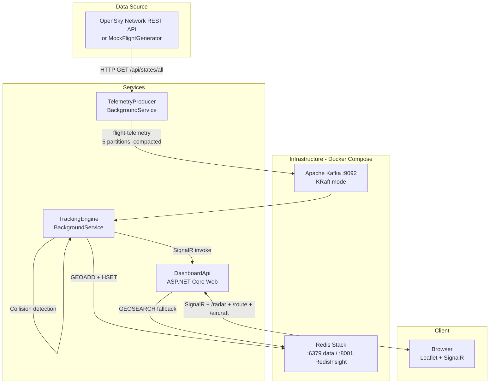

# Air Traffic Control Visualizer — Design Document

**Repository:** <https://github.com/ravindrabhartiya/AirTrafficVisualizer.git>

---

## Table of Contents

1. [Overview](#overview)
2. [Architecture](#architecture)
3. [Data Flow](#data-flow)
4. [Project Structure](#project-structure)
5. [Component Details](#component-details)
   - [ATC.Shared](#atcshared)
   - [ATC.TelemetryProducer](#atctelemetryproducer)
   - [ATC.TrackingEngine](#atctrackingengine)
   - [ATC.DashboardApi](#atcdashboardapi)
   - [ATC.Tests](#atctests)
6. [Infrastructure](#infrastructure)
7. [Data Models](#data-models)
8. [Collision Detection](#collision-detection)
9. [Cold-Start Recovery](#cold-start-recovery)
10. [Credential Management](#credential-management)
11. [Rate Limiting](#rate-limiting)
12. [Frontend Dashboard](#frontend-dashboard)
13. [Configuration Reference](#configuration-reference)
14. [Getting Started](#getting-started)
15. [Testing](#testing)
16. [Known Limitations](#known-limitations)

---

## Overview

Air Traffic Control Visualizer is a real-time flight tracking system that ingests live aircraft positions from the [OpenSky Network](https://opensky-network.org/) REST API (or generates mock data), streams them through Apache Kafka, processes them with collision detection, and renders them on an interactive Leaflet.js map in the browser — all with sub-second update latency via SignalR.

### Key Capabilities

| Capability | Detail |
|---|---|
| Live flight ingestion | OpenSky Network `/api/states/all` with HTTP Basic Auth |
| Mock mode | 200 simulated flights over the continental US |
| Stream processing | Apache Kafka with compacted topic |
| Spatial queries | Redis Geo commands for proximity / collision detection |
| Real-time push | ASP.NET Core SignalR WebSocket hub |
| Persistence | SQLite snapshot store for cold-start recovery |
| Collision warnings | Proximity + altitude threshold alerting |
| Route lookup | Per-callsign route lookup via OpenSky `/api/routes`, cached in Redis |

### Tech Stack

- **.NET 8.0** (C# 12, top-level statements, nullable reference types)
- **Apache Kafka** — single-node KRaft (no ZooKeeper) via Docker
- **Redis Stack** — geo operations + hash storage + RedisInsight UI
- **SQLite** — `Microsoft.Data.Sqlite` for lightweight persistence
- **SignalR** — real-time WebSocket push to browser clients
- **Leaflet.js** — interactive map with OpenStreetMap tiles
- **xUnit + Moq** — unit tests
- **Docker Compose** — infrastructure orchestration

---

## Architecture



---

## Data Flow

1. **Ingest** — `TelemetryProducer` polls OpenSky every 10 s (authenticated) or 22 s (anonymous). Each response contains ~5,000–12,000 global aircraft states. Flights with null lat/lon are discarded. Each valid flight is serialized as JSON and produced to Kafka topic `flight-telemetry`, keyed by ICAO24 transponder address.

2. **Process** — `TrackingEngine` consumes from Kafka. For each message:
   - Stores the position in a Redis **geo sorted set** (`active_flights`) for spatial queries.
   - Stores all flight metadata in a Redis **hash** (`flight:{icao24}`) with a 5-minute TTL.
   - Runs **collision detection** against nearby aircraft within 5 km and 1,000 ft altitude.
   - Persists to **SQLite** (`flight_snapshots` table) via UPSERT.
   - Invokes the SignalR hub method `BroadcastFlightUpdate` on `DashboardApi`.

3. **Serve** — `DashboardApi` receives the SignalR invocation and broadcasts the `FlightUpdated` event to all connected browser clients.

4. **Render** — The browser's Leaflet map updates the marker position in real time. Every 30 seconds the browser also polls `GET /radar` as a reconciliation fallback.

5. **Cleanup** — Every 60 seconds, `TrackingEngine` scans the geo set and removes entries whose hash has expired. It also purges SQLite rows older than 5 minutes.

---

## Project Structure

```
AirTrafficControl.slnx          # Solution file (XML-based slim format)
docker-compose.yaml              # Kafka + Redis infrastructure
start-all.bat                    # One-click launcher (build → test → infra → services)
DESIGN.md                        # This document
.gitignore                       # Excludes bin/, obj/, *.db, credentials, secrets

src/
  ATC.Shared/                    # Shared library (models, constants, persistence)
    FlightTelemetry.cs           # Inbound DTO from OpenSky
    FlightPosition.cs            # Outbound DTO to dashboard / SignalR
    Constants.cs                 # Kafka topic, Redis keys, thresholds
    IFlightSnapshotStore.cs      # Persistence interface
    SqliteFlightSnapshotStore.cs # SQLite implementation

  ATC.TelemetryProducer/         # Worker service — data ingestion
    Program.cs                   # DI, Kafka, Redis, HttpClient, rate limiter
    Worker.cs                    # Main loop — fetch → produce → rate limit
    MockFlightGenerator.cs       # 200 simulated flights for offline dev
    RetryAfterHandler.cs         # HTTP 429 handler with Retry-After support

  ATC.TrackingEngine/            # Worker service — stream processing
    Program.cs                   # DI, Kafka consumer, Redis, SQLite, SignalR config
    Worker.cs                    # Kafka consume loop, Redis warm, cleanup
    FlightProcessor.cs           # Core logic: Redis store, collision detect, persist
    SignalRConfig.cs             # Record for SignalR hub URL

  ATC.DashboardApi/              # ASP.NET Core web app — dashboard
    Program.cs                   # DI, Redis, SQLite, CORS, endpoints
    FlightHub.cs                 # SignalR hub — BroadcastFlightUpdate
    wwwroot/index.html           # Single-page app (Leaflet + SignalR client)

tests/
  ATC.Tests/                     # xUnit test project
    SqliteFlightSnapshotStoreTests.cs
    MockFlightGeneratorTests.cs
    SharedModelTests.cs
    RetryAfterHandlerTests.cs
    FlightHubTests.cs
    TrackingEngineTests.cs
```

---

## Component Details

### ATC.Shared

Shared class library referenced by all three services.

| Type | Purpose |
|---|---|
| `FlightTelemetry` | Inbound DTO. Fields are nullable (OpenSky may omit values). JSON property names match OpenSky conventions. |
| `FlightPosition` | Outbound DTO. Non-nullable. Used by `GET /radar`, SignalR push, and SQLite persistence. |
| `Constants` | `KafkaTopic = "flight-telemetry"`, `RedisGeoKey = "active_flights"`, `CollisionRadiusKm = 5.0`, `AltitudeThresholdFeet = 1000.0`. |
| `IFlightSnapshotStore` | Persistence interface: `UpsertAsync`, `LoadAllAsync(maxAge)`, `PurgeStaleAsync(maxAge)`. |
| `SqliteFlightSnapshotStore` | SQLite implementation. Auto-creates schema on construction. Uses `INSERT … ON CONFLICT … DO UPDATE` for upsert. Implements `IDisposable`. |

**NuGet dependencies:** `Microsoft.Data.Sqlite` 8.0.12, `System.Text.Json` 10.0.5

### ATC.TelemetryProducer

Background worker service that fetches flight data and publishes to Kafka.

**Startup flow:**
1. Read OpenSky credentials from configuration (User Secrets / env vars / appsettings).
2. If credentials are present, attach HTTP Basic Auth header and set rate limiter to 10 s. Otherwise 22 s.
3. Check Redis for last API call timestamp to avoid double-dipping on restart.
4. Enter main loop: acquire rate-limiter token → fetch → produce → repeat.

**Key classes:**

| Class | Responsibility |
|---|---|
| `Worker` | Main `ExecuteAsync` loop. Fetches from OpenSky or `MockFlightGenerator`, produces to Kafka. |
| `MockFlightGenerator` | Creates 200 simulated flights with realistic movement patterns. Every 10th flight is clustered near the previous flight to trigger collision detection. |
| `RetryAfterHandler` | `DelegatingHandler` that intercepts HTTP 429 responses, reads the `Retry-After` header, and blocks subsequent requests until the cooldown expires. |

**NuGet dependencies:** `Confluent.Kafka`, `StackExchange.Redis`, `Microsoft.Extensions.Http`

### ATC.TrackingEngine

Background worker service that consumes from Kafka, processes flights, and pushes updates to the dashboard.

**Startup flow:**
1. **Warm Redis from SQLite** — loads flights updated within the last 5 minutes and populates the geo set + hash entries. This gives the dashboard immediate data after a restart.
2. Connect to SignalR hub on `DashboardApi`.
3. Launch two parallel tasks:
   - **Consume loop** — reads Kafka messages, delegates to `FlightProcessor`, sends SignalR updates.
   - **Cleanup loop** — every 60 s, removes geo entries whose hash has expired and purges stale SQLite rows.

**Key classes:**

| Class | Responsibility |
|---|---|
| `Worker` | Orchestration: warm cache → connect SignalR → run consume + cleanup. |
| `FlightProcessor` | Extracted for testability. Handles: Redis geo add, hash set with TTL, collision detection (geo search + altitude check), SQLite upsert. Returns `(FlightPosition, List<CollisionWarning>)`. |
| `CollisionWarning` | Sealed record: `(Icao1, Icao2, DistanceKm, AltitudeDiffFeet)`. |
| `SignalRConfig` | Sealed record: `(HubUrl)`. |

**NuGet dependencies:** `Confluent.Kafka`, `StackExchange.Redis`, `Microsoft.AspNetCore.SignalR.Client`, `Microsoft.Data.Sqlite`

### ATC.DashboardApi

ASP.NET Core web application serving the dashboard UI and acting as the SignalR hub.

**Endpoints:**

| Route | Method | Description |
|---|---|---|
| `/flighthub` | WebSocket | SignalR hub. `TrackingEngine` invokes `BroadcastFlightUpdate`; browsers receive `FlightUpdated`. |
| `/radar` | GET | Returns all currently tracked flights. Reads from Redis geo set → hash lookups. Falls back to SQLite if Redis is empty (cold start). |
| `/route/{callsign}` | GET | Proxies to OpenSky `/api/routes`, caches result in Redis for 1 hour. Callsign is sanitized to alphanumeric characters only. |
| `/` | GET | Serves `wwwroot/index.html` (Leaflet SPA). |

**CORS:** Configured to allow any origin with credentials (required for SignalR WebSocket).

**NuGet dependencies:** `StackExchange.Redis`, `Microsoft.Data.Sqlite`

### ATC.Tests

xUnit test project with 27 tests across 6 test files.

| Test File | Tests | Coverage |
|---|---|---|
| `SqliteFlightSnapshotStoreTests` | 7 | Upsert, load, dedup, max-age filtering, purge, bulk, on-ground |
| `MockFlightGeneratorTests` | 7 | Flight count, custom count, coordinate bounds, unique ICAOs, movement, velocity, timestamps |
| `SharedModelTests` | 10 | FlightTelemetry JSON serialization, nullable fields, property names; FlightPosition round-trip; Constants values |
| `RetryAfterHandlerTests` | 2 | Normal request passthrough, 429 retry behavior |
| `FlightHubTests` | 1 | Hub instantiation |
| `TrackingEngineTests` | 2 | CollisionWarning record equality, SignalRConfig construction |

---

## Infrastructure

### Docker Compose Services

| Service | Image | Ports | Purpose |
|---|---|---|---|
| `kafka` | `apache/kafka:latest` | 9092 | Single-node KRaft broker (no ZooKeeper) |
| `kafka-init` | `apache/kafka:latest` | — | One-shot: creates `flight-telemetry` topic (6 partitions, compacted) |
| `redis` | `redis/redis-stack:latest` | 6379, 8001 | Redis data + RedisInsight web UI |

### Kafka Topic Configuration

| Property | Value |
|---|---|
| Topic name | `flight-telemetry` |
| Partitions | 6 |
| Replication factor | 1 |
| Cleanup policy | `compact` |
| Min cleanable dirty ratio | 0.1 |
| Delete retention | 86,400,000 ms (24 hours) |

Compaction ensures that only the latest position per ICAO24 key is retained, keeping the topic bounded.

### Redis Data Structures

| Key Pattern | Type | TTL | Description |
|---|---|---|---|
| `active_flights` | Sorted Set (Geo) | — | Geo-indexed set of all tracked aircraft. Members are ICAO24 addresses with lat/lon. |
| `flight:{icao24}` | Hash | 5 min | Full flight metadata (callsign, lat, lon, altitude, velocity, heading, vertical rate, on-ground, country, last update). |
| `route:{callsign}` | String (JSON) | 1 hour | Cached route data from OpenSky routes API. |
| `opensky:last_api_call` | String (epoch) | 1 hour | Unix timestamp of the last OpenSky API call, used for startup cooldown. |

---

## Data Models

### FlightTelemetry (inbound from OpenSky)

```csharp
public sealed class FlightTelemetry
{
    string  Icao24         // ICAO 24-bit transponder address (hex)
    string  Callsign       // Flight callsign (e.g., "UAL123")
    string  OriginCountry  // Country of registration
    double? Longitude      // WGS-84 degrees
    double? Latitude       // WGS-84 degrees
    double? BaroAltitude   // Barometric altitude in feet
    double? Velocity       // Ground speed in m/s
    double? TrueTrack      // True heading in degrees (0° = North)
    double? VerticalRate   // Climb/descent rate in ft/min
    bool    OnGround       // Whether the aircraft is on the ground
    long    LastUpdate     // Unix timestamp of last position update
}
```

### FlightPosition (outbound to dashboard)

Same fields as `FlightTelemetry` but with non-nullable numeric types (null values default to 0). This is the DTO stored in SQLite, served by `/radar`, and pushed via SignalR.

---

## Collision Detection

The `FlightProcessor` runs collision detection for every incoming flight:

1. **Proximity query** — `GEOSEARCH active_flights FROMLONLAT <lon> <lat> BYRADIUS 5 km COUNT 20`
2. **Altitude filter** — for each neighbor within 5 km, read its altitude from the Redis hash and check if `|alt_self - alt_neighbor| ≤ 1,000 ft`.
3. **Warning** — if both conditions are met, log a `CRITICAL` collision warning with both ICAO addresses, distance, and altitude difference.

**Thresholds** (defined in `Constants.cs`):
- Horizontal: 5.0 km
- Vertical: 1,000 ft

Mock data intentionally clusters every 10th flight near the previous one to consistently trigger collision warnings during development.

---

## Cold-Start Recovery

Without persistence, restarting any service results in an empty radar until the first OpenSky response arrives (10–22 seconds) and propagates through Kafka → Redis → SignalR.

**Solution: SQLite snapshot store**

1. `TrackingEngine` persists every processed flight to `flight_snapshots` table via UPSERT.
2. On startup, `TrackingEngine.WarmRedisCacheAsync()` loads all flights updated within the last 5 minutes from SQLite and populates Redis geo set + hash entries.
3. `DashboardApi.GET /radar` falls back to SQLite when the Redis geo set is empty.

**Result:** The dashboard shows aircraft immediately after a restart, even before Kafka starts producing new data.

Database file location: `flights.db` at the repository root (configured via `Sqlite:DbPath` in appsettings).

---

## Credential Management

OpenSky Network API credentials are managed via [.NET User Secrets](https://learn.microsoft.com/en-us/aspnet/core/security/app-secrets) so they never appear in source code or committed files.

### Setup (one-time per machine)

```bash
cd src/ATC.TelemetryProducer
dotnet user-secrets set "OpenSky:ClientId" "<your-opensky-username>"
dotnet user-secrets set "OpenSky:ClientSecret" "<your-opensky-password>"
```

Secrets are stored in `%APPDATA%\Microsoft\UserSecrets\<UserSecretsId>\secrets.json` (Windows) and are loaded automatically by `Host.CreateApplicationBuilder`.

### How It Works

1. `Program.cs` reads `OpenSky:ClientId` and `OpenSky:ClientSecret` from the configuration system (User Secrets → environment variables → appsettings.json, in priority order).
2. If both values are non-empty, an HTTP Basic Auth header is attached to the `"OpenSky"` named `HttpClient`.
3. The rate limiter is configured to 10 s when authenticated (higher API quota) or 22 s when anonymous.
4. `appsettings.json` contains empty placeholder values — never real credentials.

### Security Measures

- `.gitignore` excludes `credentials.json`, `secrets.json`, `*.db`, and IDE-specific directories.
- No secrets are logged or exposed via any API endpoint.
- User Secrets are stored outside the repository tree entirely.

---

## Rate Limiting

OpenSky Network enforces rate limits: ~400 requests/day for anonymous users (~22 s between requests) and ~4,000 requests/day for authenticated users (~10 s).

### Strategy

| Layer | Mechanism |
|---|---|
| **Token bucket** | `TokenBucketRateLimiter` (1 token, replenishes every 10 s or 22 s). The worker acquires a token before every API call. |
| **Startup cooldown** | On startup, the producer reads `opensky:last_api_call` from Redis. If the last call was < 22 s ago, it sleeps for the remainder. Prevents wasted credits on rapid restarts. |
| **429 handler** | `RetryAfterHandler` intercepts HTTP 429 responses, parses the `Retry-After` header, and blocks subsequent requests until the cooldown expires. |

---

## Frontend Dashboard

Single-page application served from `wwwroot/index.html`.

### Libraries

| Library | Version | Purpose |
|---|---|---|
| Leaflet.js | 1.9.4 | Map rendering with OpenStreetMap tiles |
| SignalR JS client | 8.0.0 | Real-time WebSocket connection |

### Features

- **Live aircraft markers** — SVG plane icons rotated to match heading. Color indicates normal (blue) or collision warning (red).
- **Rich tooltips** — hover to see callsign, ICAO, country, altitude, speed, heading, vertical rate.
- **Route popup** — click an aircraft to see its route (origin → destination airports), fetched from `/route/{callsign}` and cached.
- **Status bar** — connection status indicator (green/yellow/red), aircraft count, updates-per-second counter.
- **Stale marker cleanup** — markers not updated for 5 minutes are removed automatically.
- **Periodic polling** — `GET /radar` every 30 seconds reconciles state for any flights missed by SignalR.
- **Auto-reconnect** — SignalR reconnects automatically with exponential backoff (0, 1, 3, 5, 10 seconds).

---

## Configuration Reference

### ATC.TelemetryProducer — `appsettings.json`

```json
{
  "Kafka": { "BootstrapServers": "localhost:9092" },
  "Redis": { "ConnectionString": "localhost:6379" },
  "UseMockData": false,
  "OpenSky": { "ClientId": "", "ClientSecret": "" }
}
```

| Key | Default | Description |
|---|---|---|
| `Kafka:BootstrapServers` | `localhost:9092` | Kafka broker address |
| `Redis:ConnectionString` | `localhost:6379` | Redis connection string |
| `UseMockData` | `false` | `true` = use MockFlightGenerator, `false` = call OpenSky API |
| `OpenSky:ClientId` | `""` | OpenSky username (set via User Secrets) |
| `OpenSky:ClientSecret` | `""` | OpenSky password (set via User Secrets) |

### ATC.TrackingEngine — `appsettings.json`

```json
{
  "Kafka": { "BootstrapServers": "localhost:9092" },
  "Redis": { "ConnectionString": "localhost:6379" },
  "SignalR": { "HubUrl": "http://localhost:5000/flighthub" },
  "Sqlite": { "DbPath": "..\\..\\flights.db" }
}
```

| Key | Default | Description |
|---|---|---|
| `SignalR:HubUrl` | `http://localhost:5000/flighthub` | DashboardApi SignalR hub URL |
| `Sqlite:DbPath` | `flights.db` | Path to SQLite database file |

### ATC.DashboardApi — `appsettings.json`

```json
{
  "Urls": "http://0.0.0.0:5000",
  "Redis": { "ConnectionString": "localhost:6379" },
  "Sqlite": { "DbPath": "..\\..\\flights.db" }
}
```

| Key | Default | Description |
|---|---|---|
| `Urls` | `http://0.0.0.0:5000` | Listen URL. Must match `SignalR:HubUrl` in TrackingEngine. |
| `Sqlite:DbPath` | `flights.db` | Path to SQLite database file (same file as TrackingEngine) |

---

## Getting Started

### Prerequisites

- [.NET 8.0 SDK](https://dotnet.microsoft.com/download/dotnet/8.0)
- [Docker Desktop](https://www.docker.com/products/docker-desktop/) (for Kafka + Redis)
- An [OpenSky Network](https://opensky-network.org/) account (optional; mock mode works without one)

### Quick Start

```bash
# 1. Clone the repository
git clone https://github.com/ravindrabhartiya/AirTrafficVisualizer.git
cd AirTrafficVisualizer

# 2. (Optional) Configure OpenSky credentials
cd src/ATC.TelemetryProducer
dotnet user-secrets set "OpenSky:ClientId" "your-username"
dotnet user-secrets set "OpenSky:ClientSecret" "your-password"
cd ../..

# 3. Start everything
start-all.bat
```

`start-all.bat` performs these steps in order:
1. **Build + test** — `dotnet build` → `dotnet test`. Aborts on failure.
2. **Docker Compose** — starts Kafka and Redis containers.
3. **Wait** — polls until all containers are healthy.
4. **Launch services** — opens three terminal windows for TelemetryProducer, TrackingEngine, and DashboardApi.

Open **http://localhost:5000** to view the dashboard.

### Mock Mode

To run without OpenSky API access, set `UseMockData` to `true` in `src/ATC.TelemetryProducer/appsettings.json`. This generates 200 simulated flights over the continental US.

### Useful URLs

| URL | Description |
|---|---|
| http://localhost:5000 | Dashboard (Leaflet map) |
| http://localhost:8001 | RedisInsight (Redis browser) |

---

## Testing

```bash
# Run all tests
dotnet test

# Run with verbose output
dotnet test --verbosity normal

# Run a specific test file
dotnet test --filter "FullyQualifiedName~SqliteFlightSnapshotStoreTests"
```

Tests are automatically run as part of `start-all.bat`. The build aborts if any test fails.

All SQLite tests use in-memory databases (`:memory:` or temp files) and clean up after themselves.

---

## Known Limitations

1. **OpenSky coverage** — OpenSky Network relies on volunteer ADS-B receivers. Coverage is excellent over Europe and North America but sparse over oceans and remote areas. Commercial services like FlightRadar24 have 30,000+ receivers and satellite-based ADS-B, giving them significantly more coverage.

2. **Single-node Kafka** — the Docker Compose setup runs a single Kafka broker with no replication. Not suitable for production.

3. **No authentication on the dashboard** — the web interface and API endpoints are unauthenticated. In a production deployment, add authentication middleware.

4. **SQLite concurrency** — SQLite uses file-level locking. With TrackingEngine writing and DashboardApi reading the same database file, this works for a single instance but would need a shared database (e.g., PostgreSQL) for horizontal scaling.

5. **Collision detection is 2.5D** — uses Redis geo (2D) for proximity, then checks altitude difference. It does not predict future positions or account for convergence rates.

6. **No HTTPS** — local development runs over HTTP. Use a reverse proxy (nginx, Caddy) or configure Kestrel HTTPS for production.
