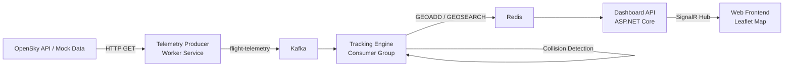

# Air Traffic Control — Real-Time Monitoring & Collision Alert System

A distributed real-time system that ingests aircraft telemetry, detects potential mid-air collisions, and renders live aircraft positions on an interactive map.

**Tech Stack**: .NET 8 · Apache Kafka (KRaft) · Redis Stack · SignalR · Leaflet.js

---

## Architecture



## Prerequisites

- [.NET 8 SDK](https://dotnet.microsoft.com/download/dotnet/8.0)
- [Docker & Docker Compose](https://docs.docker.com/get-docker/)

## Quick Start

### 1. Start Infrastructure (Kafka + Redis)

```bash
docker compose up -d
```

Wait ~30 seconds for Kafka to become healthy and the `flight-telemetry` topic to be created. You can verify:

```bash
docker compose logs kafka-init
# Should show: "Topic flight-telemetry created successfully"
```

**RedisInsight** is available at [http://localhost:8001](http://localhost:8001).

### 2. Start the Dashboard API (Project C)

```bash
cd src/ATC.DashboardApi
dotnet run
```

The API starts on **http://localhost:5000**. The web dashboard is served at the root URL.

### 3. Start the Tracking Engine (Project B)

In a new terminal:

```bash
cd src/ATC.TrackingEngine
dotnet run
```

This connects to Kafka (consumer group: `tracking-engine`) and Redis, processes telemetry, performs collision detection, and pushes updates via SignalR.

### 4. Start the Telemetry Producer (Project A)

In a new terminal:

```bash
cd src/ATC.TelemetryProducer
dotnet run
```

By default, it runs in **mock mode** generating 40 simulated flights. To use the OpenSky Network REST API instead, set `UseMockData` to `false` in `appsettings.json`.

### 5. Open the Dashboard

Navigate to **[http://localhost:5000](http://localhost:5000)** in your browser. You should see aircraft markers appearing and moving on the map in real time.

## API Endpoints

| Method | Path         | Description                              |
|--------|--------------|------------------------------------------|
| GET    | `/radar`     | Returns all tracked aircraft positions   |
| WS     | `/flighthub` | SignalR hub for real-time flight updates |

## Projects

| Project                 | Type           | Description                                                   |
|-------------------------|----------------|---------------------------------------------------------------|
| `ATC.Shared`            | Class Library  | Shared models (`FlightTelemetry`, `FlightPosition`, constants)|
| `ATC.TelemetryProducer` | Worker Service | Fetches/generates telemetry → produces to Kafka               |
| `ATC.TrackingEngine`    | Worker Service | Kafka consumer → Redis geospatial + collision detection       |
| `ATC.DashboardApi`      | Web API        | REST endpoint + SignalR hub + static file host                |

## Configuration

Each project reads from `appsettings.json`. Key settings:

**Telemetry Producer**
- `Kafka:BootstrapServers` — Kafka broker address (default: `localhost:9092`)
- `UseMockData` — `true` for simulated flights, `false` for OpenSky API

**Tracking Engine**
- `Kafka:BootstrapServers` — Kafka broker address
- `Redis:ConnectionString` — Redis address (default: `localhost:6379`)
- `SignalR:HubUrl` — Dashboard API hub URL (default: `http://localhost:5000/flighthub`)

**Dashboard API**
- `Redis:ConnectionString` — Redis address

## Collision Detection Logic

For every incoming telemetry message:
1. The aircraft position is stored in a Redis geo key (`active_flights`) using `GEOADD`
2. `GEOSEARCH` finds all aircraft within a **5 km** radius
3. For each nearby aircraft, altitude is compared: if within **±1000 ft**, a `COLLISION WARNING` is logged at `Critical` level

## Shutting Down

```bash
# Stop the .NET services with Ctrl+C (graceful shutdown via CancellationToken)

# Stop infrastructure
docker compose down

# Remove volumes too
docker compose down -v
```
